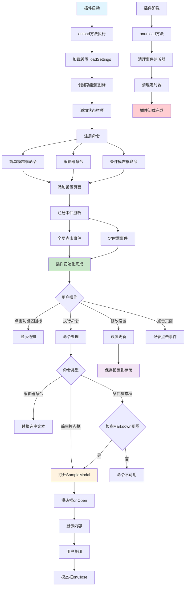
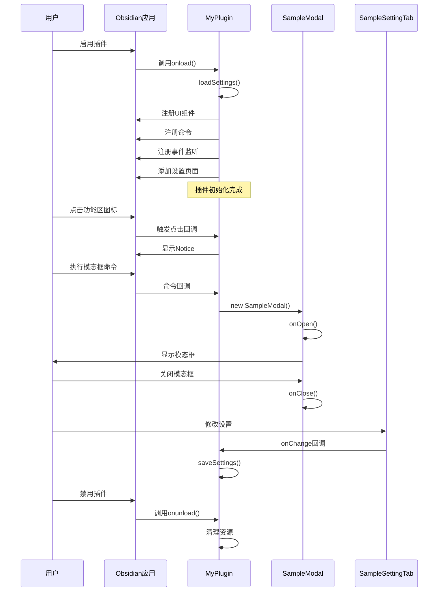

# Obsidian插件功能模块与执行流程分析

## 项目概述

这是一个Obsidian示例插件项目，展示了Obsidian插件API的基本功能。项目使用TypeScript开发，提供了完整的插件开发模板。

## 主要功能模块

### 1. 核心插件类 (MyPlugin)
- **功能**: 插件的主入口点，继承自Obsidian的Plugin基类
- **职责**: 管理插件的生命周期、注册各种功能组件
- **关键方法**:
  - `onload()`: 插件加载时的初始化逻辑
  - `onunload()`: 插件卸载时的清理逻辑
  - `loadSettings()`: 加载插件设置
  - `saveSettings()`: 保存插件设置

### 2. 用户界面组件

#### 2.1 功能区图标 (Ribbon Icon)
- **功能**: 在Obsidian左侧功能区添加插件图标
- **交互**: 点击时显示通知消息
- **图标**: 使用'dice'图标

#### 2.2 状态栏 (Status Bar)
- **功能**: 在应用底部状态栏显示插件信息
- **显示内容**: "Status Bar Text"
- **限制**: 仅在桌面版可用

#### 2.3 模态对话框 (SampleModal)
- **功能**: 提供弹窗交互界面
- **继承**: 继承自Obsidian的Modal基类
- **内容**: 显示"Woah!"文本
- **生命周期**: `onOpen()`和`onClose()`方法

### 3. 命令系统

#### 3.1 简单模态框命令
- **ID**: `open-sample-modal-simple`
- **功能**: 打开示例模态框
- **触发方式**: 命令面板或快捷键

#### 3.2 编辑器命令
- **ID**: `sample-editor-command`
- **功能**: 在当前编辑器中替换选中文本
- **操作**: 将选中内容替换为"Sample Editor Command"

#### 3.3 条件模态框命令
- **ID**: `open-sample-modal-complex`
- **功能**: 带条件检查的模态框命令
- **条件**: 仅在Markdown视图激活时可用

### 4. 设置管理

#### 4.1 设置接口 (MyPluginSettings)
- **配置项**: `mySetting` (字符串类型)
- **默认值**: "default"

#### 4.2 设置页面 (SampleSettingTab)
- **功能**: 在Obsidian设置页面添加插件配置选项
- **界面**: 提供文本输入框用于配置密钥
- **实时保存**: 输入变化时自动保存设置

### 5. 事件监听

#### 5.1 全局点击事件
- **功能**: 监听文档的点击事件
- **输出**: 在控制台记录点击信息

#### 5.2 定时器
- **功能**: 每5分钟在控制台输出"setInterval"
- **管理**: 插件卸载时自动清理

## 代码执行流程

## 插件生命周期详解

## 技术架构特点

1. **模块化设计**: 功能按模块划分，职责清晰
2. **事件驱动**: 基于Obsidian的事件系统进行交互
3. **生命周期管理**: 完整的加载和卸载流程
4. **设置持久化**: 自动保存和加载用户配置
5. **类型安全**: 使用TypeScript提供类型检查
6. **资源管理**: 自动清理事件监听器和定时器

## 扩展建议

1. **功能扩展**: 可以添加更多实用的编辑器命令
2. **UI优化**: 增强模态框的交互体验
3. **设置丰富**: 添加更多可配置选项
4. **国际化**: 支持多语言界面
5. **主题适配**: 适配不同的Obsidian主题